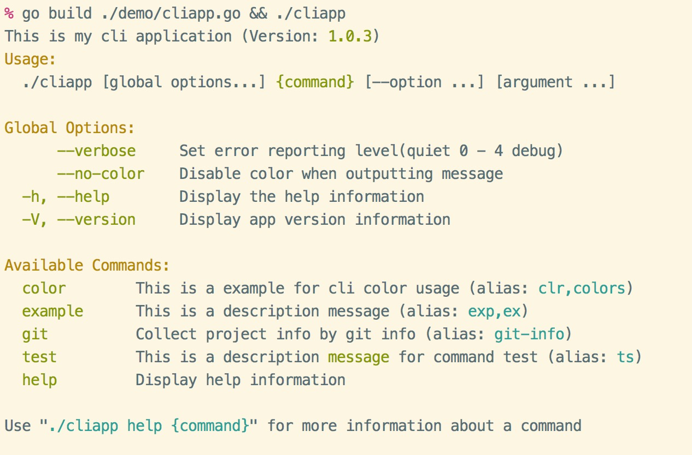
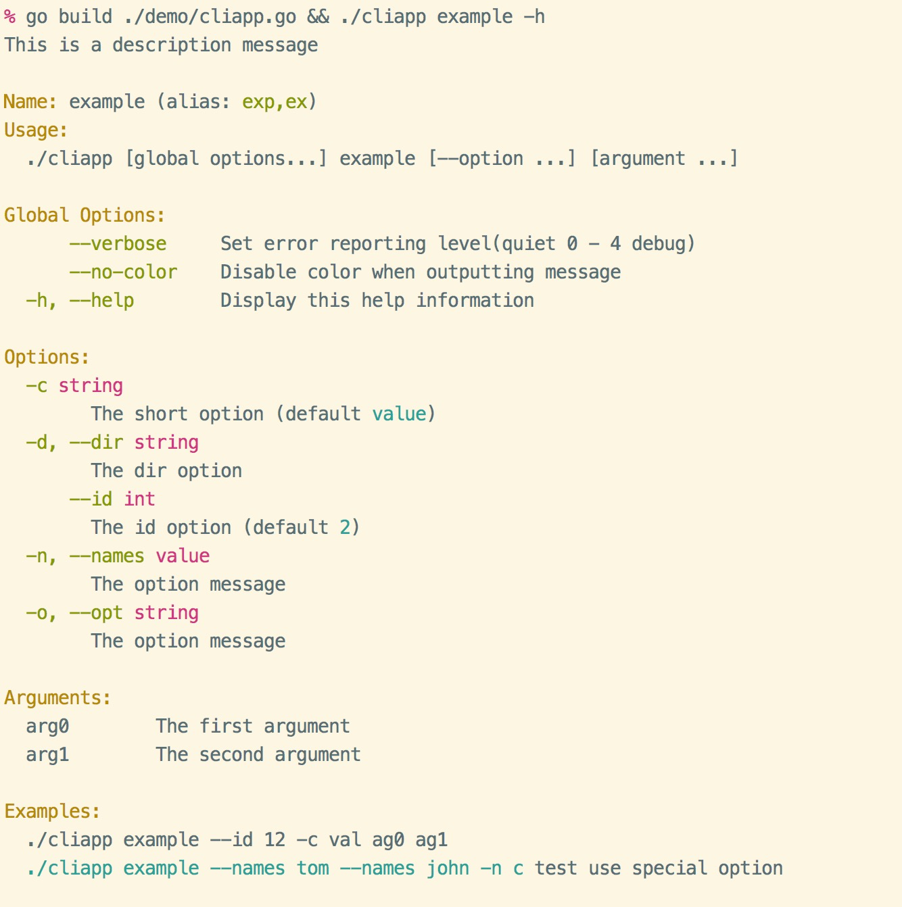

# cliapp 

Command line application, tool library, written using golang

**[中文说明](README_cn.md)**

## Features

- Easy to use
- Multiple commands can be added and command aliases are supported
- Supports a single command as a stand-alone application
- Support option binding, support for adding short options
- Supports rich color output. Supports html tab-style color rendering
- Automatically generate command help information and support color display

## Install

- use dep

```bash
dep ensure -add gopkg.in/gookit/cliapp.v1 // is recommended
// OR
dep ensure -add github.com/gookit/cliapp
```

- go get

```bash
go get gopkg.in/gookit/cliapp.v1 // is recommended
// OR
go get -u github.com/gookit/cliapp
```

- git clone

```bash
git clone https://github.com/gookit/cliapp
```

## Quick start

```bash
import "gopkg.in/gookit/cliapp.v1" // is recommended
// or
import "github.com/gookit/cliapp"
```

```go 
package main

import (
    "runtime"
    "github.com/gookit/cliapp"
    "github.com/gookit/cliapp/demo/cmd"
)

// for test run: go build ./demo/cliapp.go && ./cliapp
func main() {
    runtime.GOMAXPROCS(runtime.NumCPU())

    app := cliapp.NewApp()
    app.Version = "1.0.3"
    app.Verbose = cliapp.VerbDebug
    app.Description = "this is my cli application"

    app.Add(cmd.ExampleCommand())
    app.Add(cmd.GitCommand())
    app.Add(&cliapp.Command{
        Name: "demo",
        Aliases: []string{"dm"},
        // allow color tag and {$cmd} will be replace to 'demo'
        Description: "this is a description <info>message</> for {$cmd}", 
        Fn: func (cmd *cliapp.Command, args []string) int {
            cliapp.Stdout("hello, in the demo command\n")
            return 0
        },
    })

    // .... add more ...

    app.Run()
}
```

## Godoc

- [godoc for gopkg](https://godoc.org/gopkg.in/gookit/cliapp.v1)
- [godoc for github](https://godoc.org/github.com/gookit/cliapp)

## Usage

- build a demo package 

```bash
% go build ./demo/cliapp.go                                                           
```

### Display version

```bash
% ./cliapp --version
this is my cli application

Version: 1.0.3                                                           
```

### Display app help

> by `./cliapp` or `./cliapp -h` or `./cliapp --help`




### Run a command

```bash
% ./cliapp example --id 12 -c val ag0 ag1                          
hello, in example command
opts {id:12 c:val dir:}
args is [ag0 ag1]

```

### Display command help

> by `./cliapp example -h` or `./cliapp example --help`

```bash
% ./cliapp example -h                                                
This is a description message

Name: example(alias: exp,ex)
Usage: ./cliapp example [--option ...] [argument ...]

Global Options:
  -h, --help        Display this help information

Options:
  -c string
        The short option (default value)
  --dir string
        The dir option
  --id int
        The id option (default 2)

Arguments:
  arg0        The first argument
  arg1        The second argument
 
Examples:
  ./cliapp example --id 12 -c val ag0 ag1

```

## Write a command

### Simple use

```go
app.Add(&cliapp.Command{
    Name: "demo",
    Aliases: []string{"dm"},
    // allow color tag and {$cmd} will be replace to 'demo'
    Description: "this is a description <info>message</> for command", 
    Fn: func (cmd *cliapp.Command, args []string) int {
        cliapp.Stdout("hello, in the demo command\n")
        return 0
    },
})
```

### Write go file

> the source file at: [example.go](demo/cmd/example.go)

```go
package cmd

import (
	cli "github.com/gookit/cliapp"
	"fmt"
)

// The string flag list, implemented flag.Value interface
type Names []string

func (ns *Names) String() string {
	return fmt.Sprint(*ns)
}

func (ns *Names) Set(value string) error {
	*ns = append(*ns, value)
	return nil
}

// options for the command
var exampleOpts = struct {
	id  int
	c   string
	dir string
	opt string
	names Names
}{}

// ExampleCommand command definition
func ExampleCommand() *cli.Command {
	cmd := cli.Command{
		Name:        "example",
		Description: "this is a description message",
		Aliases:     []string{"exp", "ex"},
		Fn:          exampleExecute,
		ArgList: map[string]string{
			"arg0": "the first argument",
			"arg1": "the second argument",
		},
		// {$binName} {$cmd} is help vars. '{$cmd}' will replace to 'example'
		Examples: `{$binName} {$cmd} --id 12 -c val ag0 ag1
  <cyan>{$fullCmd} --names tom --names john -n c</> test use special option`,
	}

	// use flag package func
	cmd.Flags.IntVar(&exampleOpts.id, "id", 2, "the id option")
	cmd.Flags.StringVar(&exampleOpts.c, "c", "value", "the short option")

	// use Command provided func
	cmd.StrOpt(&exampleOpts.dir, "dir", "d", "","the dir option")

	// setting option name and short-option name
	cmd.StrOpt(&exampleOpts.opt, "opt", "o", "", "the option message")

	// setting a special option var, it must implement the flag.Value interface
	cmd.VarOpt(&exampleOpts.names, "names", "n", "the option message")

	return &cmd
}

// command running
// example run:
// 	go build cliapp.go && ./cliapp example --id 12 -c val ag0 ag1
func exampleExecute(cmd *cli.Command, args []string) int {
	fmt.Print("hello, in example command\n")

	// fmt.Printf("%+v\n", cmd.Flags)
	fmt.Printf("opts %+v\n", exampleOpts)
	fmt.Printf("args is %v\n", args)

	return 0
}
```

- display the command help：

```bash
go build ./demo/cliapp.go && ./cliapp example -h
```



## CLI Color

### Color output display


### Usage

```go
package main

import (
    "github.com/gookit/cliapp/color"
    )

func main() {
	// simple usage
	color.FgCyan.Printf("Simple to use %s\n", "color")

	// custom color
	color.New(color.FgWhite, color.BgBlack).Println("custom color style")

	// can also:
	color.Style{color.FgCyan, color.OpBold}.Println("custom color style")
	
	// use style tag
	color.Print("<suc>he</><comment>llo</>, <cyan>wel</><red>come</>\n")

	// set a style tag
	color.Tag("info").Println("info style text")

	// use info style tips
	color.Tips("info").Print("tips style text")

	// use info style blocked tips
	color.LiteTips("info").Print("blocked tips style text")
}
```

### More usage

#### Basic color functions

> support on windows `cmd.exe`

- `color.Bold(args ...interface{})`
- `color.Black(args ...interface{})`
- `color.White(args ...interface{})`
- `color.Gray(args ...interface{})`
- `color.Red(args ...interface{})`
- `color.Green(args ...interface{})`
- `color.Yellow(args ...interface{})`
- `color.Blue(args ...interface{})`
- `color.Magenta(args ...interface{})`
- `color.Cyan(args ...interface{})`

```go
color.Bold("bold message")
color.Yellow("yellow message")
```

#### Extra style functions 

> support on windows `cmd.exe`

- `color.Info()`
- `color.Note()`
- `color.Light()`
- `color.Error()`
- `color.Danger()`
- `color.Notice()`
- `color.Success()`
- `color.Comment()`
- `color.Primary()`
- `color.Warning()`
- `color.Question()`
- `color.Secondary()`

```go
color.Info("Info message")
color.Success("Success message")
```

#### Use like html tag

> **not** support on windows `cmd.exe`

```go
// use style tag
color.Print("<suc>he</><comment>llo</>, <cyan>wel</><red>come</>")
color.Println("<suc>hello</>")
color.Println("<error>hello</>")
color.Println("<warning>hello</>")

// custom color attributes
color.Print("<fg=yellow;bg=black;op=underscore;>hello, welcome</>\n")
```

- `color.Tag`

```go
// set a style tag
color.Tag("info").Print("info style text")
color.Tag("info").Printf("%s style text", "info")
color.Tag("info").Println("info style text")
```

### Internal color tags

```text
// Some internal defined style tags
// usage: <tag>content text</>

// basic tags
- red
- blue
- cyan
- black
- green
- brown
- white
- default  // no color
- normal// no color
- yellow  
- magenta 

// alert tags like bootstrap's alert
- suc // same "green" and "bold"
- success 
- info // same "green"
- comment  // same "brown"
- note 
- notice  
- warn
- warning 
- primary 
- danger // same "red"
- err 
- error

// more tags
- lightRed
- light_red
- lightGreen
- light_green
- lightBlue 
- light_blue
- lightCyan
- light_cyan
- lightDray
- light_gray
- gray
- darkGray
- dark_gray
- lightYellow
- light_yellow  
- lightMagenta  
- light_magenta 

// extra
- lightRedEx
- light_red_ex
- lightGreenEx
- light_green_ex 
- lightBlueEx
- light_blue_ex  
- lightCyanEx
- light_cyan_ex  
- whiteEx
- white_ex

// option
- bold
- underscore 
- reverse
```

## Ref

- `issue9/term` https://github.com/issue9/term
- `beego/bee` https://github.com/beego/bee
- `inhere/console` https://github/inhere/php-console
- [ANSI escape code](https://en.wikipedia.org/wiki/ANSI_escape_code)

## License

MIT
