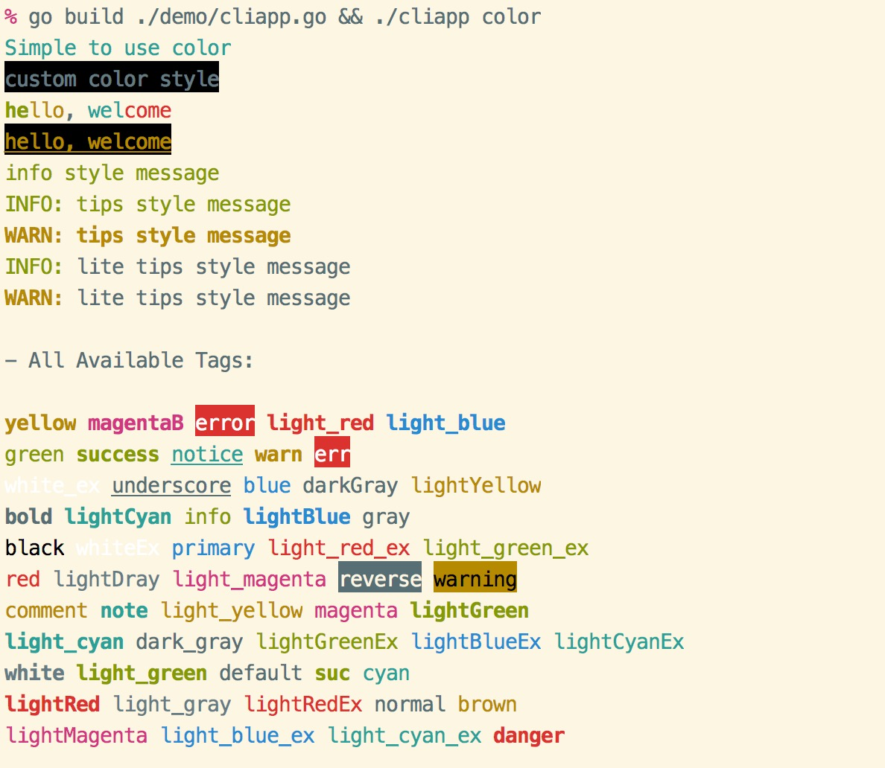

# cliapp

golang下的命令行应用，工具库

**[EN Readme](README.md)**

## 功能特色

- 使用简单方便
- 可以添加多个命令，并且支持命令别名
- 支持单个命令当做独立应用运行
- 支持选项绑定，支持添加短选项
- 支持丰富的颜色输出。同时支持html标签式的颜色渲染
- 自动生成命令帮助信息，并且支持颜色显示

## 获取安装

- 使用 dep 包管理

```bash
dep ensure -add gopkg.in/gookit/cliapp.v1 // 推荐
// OR
dep ensure -add github.com/gookit/cliapp
```

- 使用 go get

```bash
go get gopkg.in/gookit/cliapp.v1 // 推荐
// OR
go get -u github.com/gookit/cliapp
```

- git 克隆

```bash
git clone https://github.com/gookit/cliapp
```

## 快速开始

如下，引入当前包就可以快速的编写cli应用了

```bash
import "gopkg.in/gookit/cliapp.v1" // 推荐
// or
import "github.com/gookit/cliapp"
```

```go 
package main

import (
    "runtime"
    "github.com/gookit/cliapp"
    "github.com/gookit/cliapp/demo/cmd"
)

// for test run: go build ./demo/cliapp.go && ./cliapp
func main() {
    runtime.GOMAXPROCS(runtime.NumCPU())

    app := cliapp.NewApp()
    app.Version = "1.0.3"
    app.Verbose = cliapp.VerbDebug
    app.Description = "this is my cli application"

    app.Add(cmd.ExampleCommand())
    app.Add(cmd.GitCommand())
    app.Add(&cliapp.Command{
        Name: "demo",
        Aliases: []string{"dm"},
        // allow color tag and {$cmd} will be replace to 'demo'
        Description: "this is a description <info>message</> for command", 
        Fn: func (cmd *cliapp.Command, args []string) int {
            cliapp.Stdout("hello, in the demo command\n")
            return 0
        },
    })

    // .... add more ...

    app.Run()
}
```

## Godoc

- [godoc for gopkg](https://godoc.org/gopkg.in/gookit/cliapp.v1)
- [godoc for github](https://godoc.org/github.com/gookit/cliapp)

## 使用说明

先使用本项目下的 [demo](demo/) 示例代码构建一个小的cli demo应用

```bash
% go build ./demo/cliapp.go                                                           
```

### 打印版本信息

打印我们在创建cli应用时设置的版本信息

```bash
% ./cliapp --version
This is my cli application

Version: 1.0.3                                                           
```

### 应用帮助信息

使用 `./cliapp` 或者 `./cliapp -h` 来显示应用的帮助信息，包含所有的可用命令和一些全局选项


### 运行一个命令

```bash
% ./cliapp example --id 12 -c val ag0 ag1                          
hello, in example command
opts {id:12 c:val dir:}
args is [ag0 ag1]

```

### 显示一个命令的帮助

> by `./cliapp example -h` or `./cliapp example --help`

```bash
% ./cliapp example -h                                                
This is a description message

Name: example(alias: exp,ex)
Usage: ./cliapp example [--option ...] [argument ...]

Global Options:
  -h, --help        Display this help information

Options:
  -c string
        The short option (default value)
  --dir string
        The dir option
  --id int
        The id option (default 2)

Arguments:
  arg0        The first argument
  arg1        The second argument
 
Examples:
  ./cliapp example --id 12 -c val ag0 ag1

```

## 编写命令

### 简单使用

```go
app.Add(&cliapp.Command{
    Name: "demo",
    Aliases: []string{"dm"},
    // allow color tag and {$cmd} will be replace to 'demo'
    Description: "this is a description <info>message</> for command", 
    Fn: func (cmd *cliapp.Command, args []string) int {
        cliapp.Stdout("hello, in the demo command\n")
        return 0
    },
})
```

### 使用独立的文件

> the source file at: [example.go](demo/cmd/example.go)

```go
package cmd

import (
	cli "github.com/gookit/cliapp"
	"fmt"
)

// The string flag list, implemented flag.Value interface
type Names []string

func (ns *Names) String() string {
	return fmt.Sprint(*ns)
}

func (ns *Names) Set(value string) error {
	*ns = append(*ns, value)
	return nil
}

// options for the command
var exampleOpts = struct {
	id  int
	c   string
	dir string
	opt string
	names Names
}{}

// ExampleCommand command definition
func ExampleCommand() *cli.Command {
	cmd := cli.Command{
		Fn:      exampleExecute,
		Name:    "example",
		Aliases: []string{"exp", "ex"},
		ArgList: map[string]string{
			"arg0": "the first argument",
			"arg1": "the second argument",
		},
		Description: "this is a description message",
		// {$binName} {$cmd} is help vars. '{$cmd}' will replace to 'example'
		Examples: `{$binName} {$cmd} --id 12 -c val ag0 ag1
  <cyan>{$fullCmd} --names tom --names john -n c</> test use special option`,
	}

	// use flag package func
	cmd.Flags.IntVar(&exampleOpts.id, "id", 2, "the id option")
	cmd.Flags.StringVar(&exampleOpts.c, "c", "value", "the short option")

	// use Command provided func
	cmd.StrOpt(&exampleOpts.dir, "dir", "d", "","the dir option")

	// setting option name and short-option name
	cmd.StrOpt(&exampleOpts.opt, "opt", "o", "", "the option message")

	// setting a special option var, it must implement the flag.Value interface
	cmd.VarOpt(&exampleOpts.names, "names", "n", "the option message")

	return &cmd
}

// command running
// example run:
// 	go build cliapp.go && ./cliapp example --id 12 -c val ag0 ag1
func exampleExecute(cmd *cli.Command, args []string) int {
	fmt.Print("hello, in example command\n")

	// fmt.Printf("%+v\n", cmd.Flags)
	fmt.Printf("opts %+v\n", exampleOpts)
	fmt.Printf("args is %v\n", args)

	return 0
}
```

- 查看此命令的帮助信息：

```bash
go build ./demo/cliapp.go && ./cliapp example -h
```

> 漂亮的帮助信息就已经自动生成并展示出来了


## 使用颜色输出

### 颜色输出展示



### 如何使用

```go
package main

import (
    "github.com/gookit/cliapp/color"
 )

func main() {
	// simple usage
	color.FgCyan.Printf("Simple to use %s\n", "color")

	// custom color
	color.New(color.FgWhite, color.BgBlack).Println("custom color style")

	// can also:
	color.Style{color.FgCyan, color.OpBold}.Println("custom color style")
	
	// use style tag
	color.Print("<suc>he</><comment>llo</>, <cyan>wel</><red>come</>\n")

	// set a style tag
	color.Tag("info").Println("info style text")

	// use info style tips
	color.Tips("info").Print("tips style text")

	// use info style blocked tips
	color.LiteTips("info").Print("blocked tips style text")
}
```

### 构建风格

```go
// 仅设置前景色
color.FgCyan.Printf("Simple to use %s\n", "color")
// 仅设置背景色
color.BgRed.Printf("Simple to use %s\n", "color")

// 完全自定义 前景色 背景色 选项
style := color.New(color.FgWhite, color.BgBlack, color.OpBold)
style.Println("custom color style")

// can also:
color.Style{color.FgCyan, color.OpBold}.Println("custom color style")
```

```go
// 设置console颜色
color.Set(color.FgCyan)

// 输出信息
fmt.Print("message")

// 重置console颜色
color.Reset()
```

### 使用内置风格

- 使用颜色标签

使用颜色标签可以非常方便简单的构建自己需要的任何格式

```go
// 使用内置的 color tag
color.Print("<suc>he</><comment>llo</>, <cyan>wel</><red>come</>")
color.Println("<suc>hello</>")
color.Println("<error>hello</>")
color.Println("<warning>hello</>")

// 自定义颜色属性
color.Print("<fg=yellow;bg=black;op=underscore;>hello, welcome</>\n")
```

- 使用 `color.Tag`

给后面输出的文本信息加上给定的颜色风格标签

```go
// set a style tag
color.Tag("info").Print("info style text")
color.Tag("info").Printf("%s style text", "info")
color.Tag("info").Println("info style text")
```

### 内置的标签

这里列出了内置的标签，基本上涵盖了各种风格和颜色搭配。它们都可用作颜色标签，或者作为 `color.Tag` `color.Tips` 等的参数

```text
// Some internal defined style tags
// usage: <tag>content text</>

// basic tags
- red
- blue
- cyan
- black
- green
- brown
- white
- default  // no color
- normal// no color
- yellow  
- magenta 

// alert tags like bootstrap's alert
- suc // same "green" and "bold"
- success 
- info // same "green"
- comment  // same "brown"
- note 
- notice  
- warn
- warning 
- primary 
- danger // same "red"
- err 
- error

// more tags
- lightRed
- light_red
- lightGreen
- light_green
- lightBlue 
- light_blue
- lightCyan
- light_cyan
- lightDray
- light_gray
- gray
- darkGray
- dark_gray
- lightYellow
- light_yellow  
- lightMagenta  
- light_magenta 

// extra
- lightRedEx
- light_red_ex
- lightGreenEx
- light_green_ex 
- lightBlueEx
- light_blue_ex  
- lightCyanEx
- light_cyan_ex  
- whiteEx
- white_ex

// option
- bold
- underscore 
- reverse
```

## 参考项目

- `issue9/term` https://github.com/issue9/term
- `beego/bee` https://github.com/beego/bee
- `inhere/console` https://github/inhere/php-console
- [ANSI转义序列](https://zh.wikipedia.org/wiki/ANSI转义序列)
- [Standard ANSI color map](https://conemu.github.io/en/AnsiEscapeCodes.html#Standard_ANSI_color_map)
- go package: `golang.org/x/crypto/ssh/terminal`

## License

MIT
